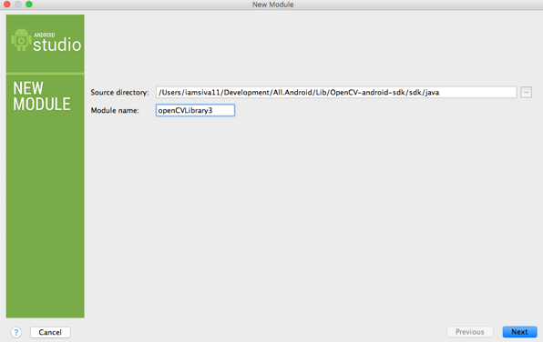
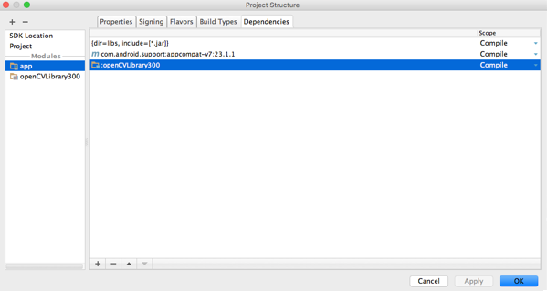
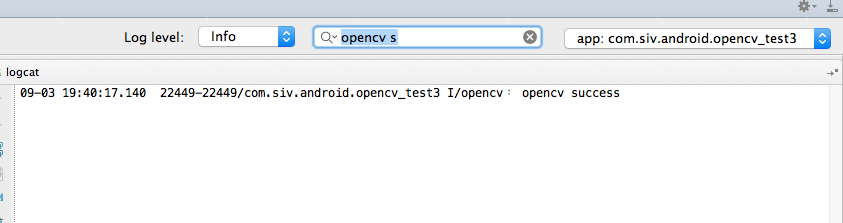

##Setting up OpenCV on Android Studio

* Download Android Studio from https://developer.android.com/sdk/,  if not done already

* Download OpenCV4Android SDK from http://sourceforge.net/projects/opencvlibrary/files/opencv-android/ ( V3.0.0 as of now)

* Extract the two files to a known location.

* Create a normal Android Project and name it FirstOpenCVApp. Navigate to File | Import.

* Select the OpenCV_SDK_location/sdk/java/ directory.

* Navigate to Build | Rebuild Project.

* Navigate to File | Project Structure.

* Add the OpenCV module to your app by selecting the app module in the left column. Click on the green in the dependencies tab, and finally, select the OpenCV module.

* You are now ready to use OpenCV in your Android project. 


###Add this code to your main activity file

```java
private BaseLoaderCallback mLoaderCallback = new BaseLoaderCallback(this) {
        @Override
        public void onManagerConnected(int status) {
            switch (status) {
                case LoaderCallbackInterface.SUCCESS:
                {
                    Log.i("opencv", "opencv success");
                    Toast.makeText(MainActivity.this, "Opencv works",
                            Toast.LENGTH_LONG).show();
                } break;
                default:
                {
                    super.onManagerConnected(status);
                } break;
            }
        }
    };

```

#####Call this inside the onCreate() method

```java
OpenCVLoader.initAsync(OpenCVLoader.OPENCV_VERSION_2_4_8, this, mLoaderCallback);
```

###SCREENSHOTS

Just to check if you have went through the same process as mine smoothly. I'm posting the flow of the screenshots below.

*Importing the downloaded opencv library to Android studio as Module 


*Add opencv module library to the project


*Success log, if OpenCv is perfectly set up. Cheers!



